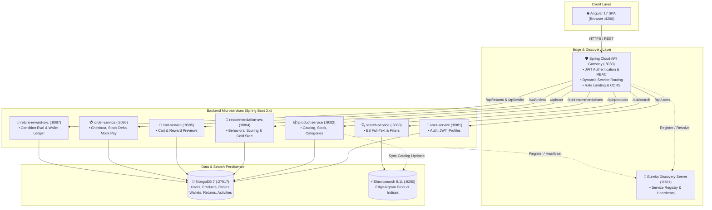
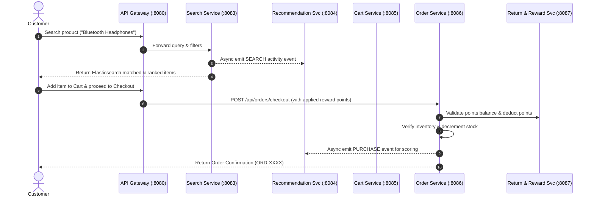
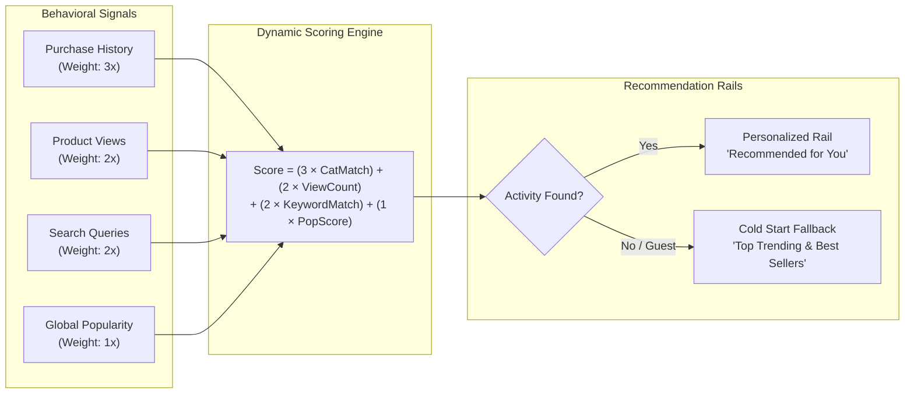
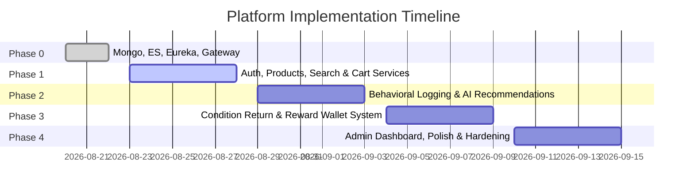

# 🛍️ NextGen AI E-Commerce & Reward Platform

[](https://spring.io/projects/spring-boot)
[](https://spring.io/projects/spring-cloud)
[](https://angular.io/)
[](https://www.oracle.com/java/)
[](https://www.mongodb.com/)
[](https://www.elastic.co/)
[](LICENSE)

An enterprise-grade, microservices-driven e-commerce platform featuring **real-time behavioral AI recommendations** and an innovative **condition-based product return and reward wallet ecosystem**.

---

## 📑 Table of Contents

- [Overview & Core Differentiators](#-overview--core-differentiators)
- [System Architecture](#-system-architecture)
- [Service Communication & Data Flow](#-service-communication--data-flow)
- [Return & Reward Lifecycle Flow](#-return--reward-lifecycle-flow)
- [Recommendation Engine Scoring Model](#-recommendation-engine-scoring-model)
- [Repository Structure](#-repository-structure)
- [Microservices Catalog & Port Allocation](#-microservices-catalog--port-allocation)
- [Key Business Rules & Formulas](#-key-business-rules--formulas)
- [API Gateway Routing Overview](#-api-gateway-routing-overview)
- [Prerequisites](#-prerequisites)
- [Quick Start Guide](#-quick-start-guide)
  - [1. Clone Repository](#1-clone-repository)
  - [2. Environment Configuration](#2-environment-configuration)
  - [3. Start Infrastructure & Core Services](#3-start-infrastructure--core-services)
  - [4. Seed Database & Search Index](#4-seed-database--search-index)
  - [5. Run Backend Microservices](#5-run-backend-microservices)
  - [6. Launch Frontend Client](#6-launch-frontend-client)
- [Testing & Postman Suite](#-testing--postman-suite)
- [Roadmap & Phased Rollout](#-roadmap--phased-rollout)
- [License & Authors](#-license--authors)

---

## 🌟 Overview & Core Differentiators

Unlike conventional online retail applications, this platform addresses two major modern e-commerce challenges:

1. **Intelligent Hyper-Personalization**:
   - Collects real-time behavioral user signals (`VIEW`, `SEARCH`, and `PURCHASE`).
   - Dynamically ranks products using behavioral scoring with immediate fallback to category-level and popularity rankings for cold-start users.
   - Separate contextual surfaces: **"Recommended for You"** on Homepage and **"Based on Your Activity"** on Product Details.

2. **Condition-Based Return & Reward Wallet Ecosystem**:
   - Dedicated return mechanism limited to verified purchases made through the platform (`isEligibleForReturn = true`).
   - **Two-Stage Reward Estimation & Finalization**: Provides upfront estimated rewards when customer files a claim, then evaluates physical condition in the warehouse.
   - Rewards are credited into an integrated **Reward Wallet** (1 Point = ₹1) that can be redeemed as instant discounts during checkout.

---

## 🏛️ System Architecture

The solution follows a distributed, decoupled **Cloud-Native Microservices Architecture** orchestrated with Spring Cloud Gateway and Netflix Eureka service discovery.



---

## 🔄 Service Communication & Data Flow



---

## 🔁 Return & Reward Lifecycle Flow

The condition evaluation lifecycle guarantees transactional integrity between user return claims and administrative inspection:

```mermaid
stateDiagram-v2
    [*] --> REQUESTED: Customer initiates return (Claims Condition: LIKE_NEW/GOOD/FAIR/POOR)
    note right of REQUESTED: Displays Estimated Reward (Disclaimer: Subject to physical inspection)
    
    REQUESTED --> APPROVED: Return request accepted for pickup
    REQUESTED --> REJECTED: Return window expired (>14 days) or ineligible
    
    APPROVED --> PRODUCT_RECEIVED: Warehouse receives package
    
    PRODUCT_RECEIVED --> UNDER_INSPECTION: Admin inspector inspects item physical condition
    
    UNDER_INSPECTION --> APPROVED_FOR_REWARD: Verified condition confirmed (Multiplier Applied)
    UNDER_INSPECTION --> REJECTED: Ineligible / Damaged / Fraudulent (0% Multiplier)
    
    APPROVED_FOR_REWARD --> COMPLETED: Final Reward Points credited to User Wallet (EARNED tx created)
    REJECTED --> COMPLETED: Request finalized with rejection note
    
    COMPLETED --> [*]
```

---

## 🧮 Recommendation Engine Scoring Model

The recommendation service continuously calculates affinity weights for each active user without complex external dependencies:



---

## 📁 Repository Structure

```
.
├── backend/                              # Spring Boot Microservices
│   ├── api-gateway/                      # Spring Cloud Gateway (Port 8080)
│   ├── eureka-server/                    # Netflix Eureka Registry (Port 8761)
│   ├── common-lib/                       # Shared DTOs, JwtUtil, exceptions, configs
│   ├── user-service/                     # User management, auth & profile
│   ├── product-service/                  # Product catalog, categories, inventory
│   ├── search-service/                   # Elasticsearch integration & filtering
│   ├── recommendation-service/           # User activity collector & scoring engine
│   ├── cart-service/                     # Shopping cart & points estimation
│   ├── order-service/                    # Order processing, stock & payment orchestration
│   ├── return-reward-service/            # Condition returns, wallet ledger & points
│   ├── pom.xml                           # Root Maven aggregator POM
│   └── PHASE0-RUNBOOK.md                 # Bootstrap verification runbook
│
├── frontend/                             # Angular 17 Single Page Application
│   └── src/app/
│       ├── core/                         # Guards (Auth, Admin), JWT Interceptor, Services
│       ├── features/                     # Auth, Catalog, Cart, Checkout, Returns, Wallet, Admin
│       └── shared/                       # Reusable UI components, chips, reward badges
│
├── seed/                                 # Database Initialization
│   └── mongo_seed.js                     # Seed collections (users, categories, products)
│
├── postman/                              # API Testing Collections
│   └── ecom-phase0.json                  # Health & service request suite
│
├── IMPLEMENTATION.md                     # Detailed Technical Specification & SRS mapping
└── README.md                             # Comprehensive project documentation
```

---

## 🔌 Microservices Catalog & Port Allocation

| Service | Port | Database / Storage | Key Responsibilities |
|---|---|---|---|
| **API Gateway** | `8080` | None | Single entry point, JWT authentication filter, route forwarding, rate limiting |
| **User Service** | `8081` | MongoDB (`users`) | Customer & Admin accounts, BCrypt passwords, JWT issuance, profile management |
| **Product Service** | `8082` | MongoDB (`products`, `categories`) | Catalog management, stock updates, admin CRUD, triggers ES index sync |
| **Search Service** | `8083` | Elasticsearch (`products` index) | Edge-ngram search, faceted category/price filters, sorting, logs search activity |
| **Recommendation Service** | `8084` | MongoDB (`user_activities`) | Aggregates VIEW/SEARCH/PURCHASE events, computes weighted affinity scores |
| **Cart Service** | `8085` | MongoDB (`carts`) | Real-time cart synchronization, stock availability checks, points deduction preview |
| **Order Service** | `8086` | MongoDB (`orders`) | Checkout orchestration, payment simulation, stock decrement, purchase events |
| **Return & Reward Service** | `8087` | MongoDB (`returns`, `wallets`, `tx`) | Return eligibility verification, admin condition grading, reward wallet ledger |
| **Eureka Server** | `8761` | In-Memory Registry | Centralized service discovery and instance health monitoring |
| **MongoDB** | `27017` | Persistent Volume | Primary document store for operational collections |
| **Elasticsearch** | `9200` | Persistent Volume | High-performance distributed search index |
| **Frontend SPA** | `4200` | Node / Angular | Responsive customer storefront and administrator dashboard |

---

## ⚖️ Key Business Rules & Formulas

### 1. Condition Multipliers & Reward Calculation
Returns are only accepted for items purchased on this platform, in status `DELIVERED`, and within a **14-day return window**.

$$\text{Estimated Reward} = \lfloor \text{Product Price} \times \text{Quantity} \times \text{Multiplier}(\text{Claimed Condition}) \times \text{Point Rate} \rfloor$$

$$\text{Final Reward} = \lfloor \text{Product Price} \times \text{Quantity} \times \text{Multiplier}(\text{Verified Condition}) \times \text{Point Rate} \rfloor$$

| Condition Rating | Description | Reward Multiplier |
|---|---|---|
| `LIKE_NEW` | Unused, original packaging intact, tags intact | **80%** |
| `GOOD` | Lightly used, minor signs of handling, fully functional | **60%** |
| `FAIR` | Noticeable wear or cosmetic marks, fully functional | **40%** |
| `POOR` | Heavy wear, functional with minor limitations | **10%** |
| `NOT_ELIGIBLE` | Damaged, counterfeit, missing parts, or modified | **0% (Rejected)** |

### 2. Reward Redemption at Checkout
- **Exchange Rate**: $1\text{ Reward Point} = ₹1\text{ INR}$.
- **Redemption Cap**: Maximum **20%** of order subtotal can be covered using reward points.
- **Transactional Safety**: Balance verification uses atomic optimistic check:
  $$\text{Deduction requires: } \text{User Balance} \ge \text{Points to Redeem}$$

---

## 🛣️ API Gateway Routing Overview

All external requests pass through `http://localhost:8080`:

| Path Prefix | Target Microservice | Authentication / RBAC |
|---|---|---|
| `/api/users/login`, `/api/users/register` | `user-service:8081` | Public |
| `/api/users/me/**` | `user-service:8081` | Authenticated (JWT) |
| `/api/products/**` (GET) | `product-service:8082` | Public |
| `/api/products/**` (POST, PUT, DELETE) | `product-service:8082` | Role: `ADMIN` |
| `/api/categories/**` | `product-service:8082` | Read: Public \| Write: `ADMIN` |
| `/api/search/**` | `search-service:8083` | Public |
| `/api/recommendations/**` | `recommendation-service:8084` | Contextual (Public / User ID) |
| `/api/cart/**` | `cart-service:8085` | Authenticated (JWT) |
| `/api/orders/**` | `order-service:8086` | Authenticated (JWT) |
| `/api/returns/**` | `return-reward-service:8087` | Customer (Own) / `ADMIN` (Evaluate) |
| `/api/wallet/**`, `/api/rewards/**` | `return-reward-service:8087` | Authenticated (JWT) |

---

## 💻 Prerequisites

Ensure the following tools are installed on your workstation:

- **Java JDK 17+** (JDK 21 or 25 with `--release 17` supported)
- **Node.js 20+** and **npm 10+**
- **Apache Maven 3.9+** (`winget install Apache.Maven` on Windows)
- **MongoDB 7+** (local install or MongoDB Atlas) + `mongosh`
- **Elasticsearch 8.11+** (local install or Elastic Cloud)

---

## 🚀 Quick Start Guide

### 1. Clone Repository

```bash
git clone https://github.com/Trilochan77/E-commerce.git
cd E-commerce
```

### 2. Environment Configuration

Set the common secret key used for signing and validating JWT tokens (minimum 32 characters):

```powershell
# PowerShell (Windows)
$env:JWT_SECRET="ecom-secure-secret-key-production-min-32-chars"

# Linux / macOS Bash
export JWT_SECRET="ecom-secure-secret-key-production-min-32-chars"
```

### 3. Start Infrastructure

Start MongoDB and Elasticsearch natively (or use Atlas / Elastic Cloud), then Eureka + Gateway via Maven:

```powershell
# Administrator PowerShell (normal terminals can't start the service):
Start-Service MongoDB
# verify:
mongosh --eval "db.adminCommand('ping')"
curl http://localhost:9200   # optional — search falls back to MongoDB if ES is down
```

See `SETUP.md` for the full step-by-step (incl. manual `mongod` fallback and verified environment notes).

Verify service status:
- **Eureka Dashboard**: [http://localhost:8761](http://localhost:8761)
- **Elasticsearch Cluster Health**: [http://localhost:9200/_cluster/health](http://localhost:9200/_cluster/health)
- **Gateway Health Check**: [http://localhost:8080/actuator/health](http://localhost:8080/actuator/health)

### 4. Seed Database & Search Index

Populate default categories, sample products, and default test accounts:

```powershell
# Seed MongoDB
mongosh --file seed/mongo_seed.js
```

Default credentials provisioned:
- **Admin**: `admin@shop.com` / `Admin@123`
- **Customer**: `user@shop.com` / `User@123`

### 5. Run Backend Microservices

Build common libraries and run individual services using Maven:

```powershell
# Install common-lib once, then run each service in its own terminal
cd backend
mvn -q -pl common-lib install
mvn -q -pl eureka-server spring-boot:run
# then in new terminals: api-gateway, user-service, product-service, etc.
# e.g. mvn -q -pl user-service spring-boot:run
```

### 6. Launch Frontend Client

```bash
cd frontend
npm install
ng serve
```

Access the web interface at **`http://localhost:4200`**.

---

## 🧪 Testing & Postman Suite

A pre-configured Postman collection is provided in `postman/ecom-phase0.json`.

1. Open Postman and click **Import**.
2. Select [`postman/ecom-phase0.json`](file:///d:/Project/postman/ecom-phase0.json).
3. Execute the automated test run:
   - **Infrastructure Health Checks**: Tests Mongo, Elasticsearch, Eureka, and Gateway endpoints.
   - **User Authentication Flow**: Tests registration, JWT token generation, and secure endpoint access.

---

## 🗺️ Roadmap & Phased Rollout



- [x] **Phase 0: Foundation**: Multi-module Maven setup, native Mongo/ES setup, Eureka Discovery, API Gateway routing, seed fixtures.
- [ ] **Phase 1: Core Commerce**: User registration/auth, product catalog, Elasticsearch sync, shopping cart, and order placement.
- [ ] **Phase 2: Recommendation Engine**: Real-time activity telemetry (VIEW, SEARCH, PURCHASE) and scoring engine.
- [ ] **Phase 3: Condition-Based Return & Wallet**: Return lifecycle workflow, admin condition inspection, and wallet ledger.
- [ ] **Phase 4: Admin Portal & Final Polish**: Unified Angular dashboard, security hardening, rate limiting, and end-to-end demo flows.

---

## 📄 License & Authors

Distributed under the **MIT License**. See `LICENSE` for more information.

Developed by **Trilochan** ([@Trilochan77](https://github.com/Trilochan77)).
